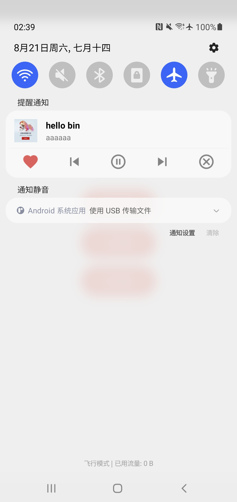

# react-native-audio-notification 🪁

[](https://badge.fury.io/js/react-native-audio-notification) ](https://img.shields.io/github/stars/haxibiao/react-native-audio-notification?style=social)

[简体中文](README.md) | [English](README_EN.md)

🪁 适用于 React Native 的一个 Android 音频通知控制模块

> ⚠️ 目前仅适用于 Android 设备

## 安装 🔨

```sh
npm install react-native-audio-notification
```

或者

```sh
yarn add react-native-audio-notification
```

## 使用 📚

```js
import AudioNotification from 'react-native-audio-notification';

// 初始化 AudioNotification
const audio = {
  title: '有没有那么一首歌',
  description: '听了这首歌希望你能不那么悲伤…',
  cover:
    'https://cos.haxibiao.com/storage/app-haxibiao/images60d9f18cbe7f4.png',
  is_play: true,
  is_like: true,
};
const notice = AudioNotification(audio);

// 推送通知
notice.notify();

// 关闭通知
notice.cancel();

// 修改配置
notice.setAudioConfig(audio);

// 更新通知（当重新设置音频数据时调用）
notice.update();

// 监听用户事件
const action = 'onClickLike' | 'onClickLast' | 'onClickPlay' | 'onClickNext' | 'onClickClose';
notice?.subscribe(action, (event: any) => {
  console.log('User manipulated ' + action, event);
});

```

> 更多使用详细代码例子可以查看 [example/src/App.tsx](/example/src/App.tsx)

## 预览 📎

<a href="docs/static/screenshot_001.jpg">
  
</a>

## 贡献

可以查看 [贡献指南](CONTRIBUTING.md) 提交 PR 或者提出 Issue ， 我们会尽快处理 ❤️

使用模块的话可以点个 Star 鼓励一下我们

## License

MIT

The copyright of the music cover image belongs to the original author. We do not save or modify it, but only for demonstration.
