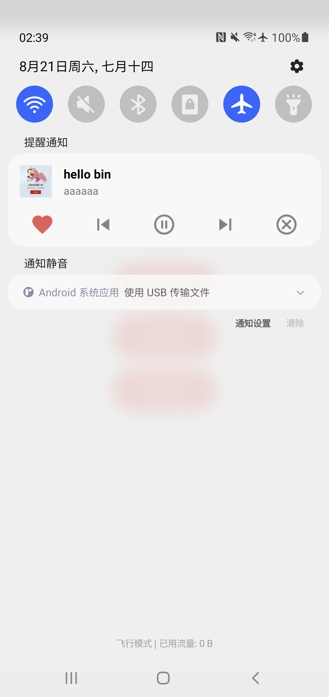

# react-native-audio-notification 🪁

[](https://badge.fury.io/js/react-native-audio-notification) ](https://img.shields.io/github/stars/haxibiao/react-native-audio-notification?style=social)

[简体中文](README.md) | [English](README_EN.md)

🪁 React Native Audio notification for Android

> ⚠️ Currently only available for Android devices

## Installation

```sh
npm install react-native-audio-notification
```

or

```sh
yarn add react-native-audio-notification
```

## Usage

```js
import AudioNotification from 'react-native-audio-notification';

// Initialization AudioNotification
const audio = {
  title: 'STAY',
  description: 'The Kid LAROI / Justin Bieber',
  cover:
    'http://p2.music.126.net/e5cvcdgeosDKTDrkTfZXnQ==/109951166155165682.jpg',
  is_play: true,
  is_like: true,
};
const notice = AudioNotification(audio);

// Push Notification
notice.notify();

// Turn off notification
notice.cancel();

// Modify configuration
notice.setAudioConfig(audio);

// Update notification (called when audio data is reset)
notice.update();

// Monitor user events
const action = 'onClickLike' | 'onClickLast' | 'onClickPlay' | 'onClickNext' | 'onClickClose';
notice?.subscribe(action, (event: any) => {
  console.log('User manipulated ' + action, event);
});
```

> for more detailed code examples, you can see [example/src/App.tsx](/example/src/App.tsx)

## Screenshot

<a href="docs/static/screenshot_001.jpg">
  
</a>

## Contributing

See the [contributing guide](CONTRIBUTING.md) to learn how to contribute to the repository and the development workflow.

If you use the module, you can click Star to encourage us.
## License

MIT

The copyright of the music cover image belongs to the original author. We do not save or modify it, but only for demonstration.
